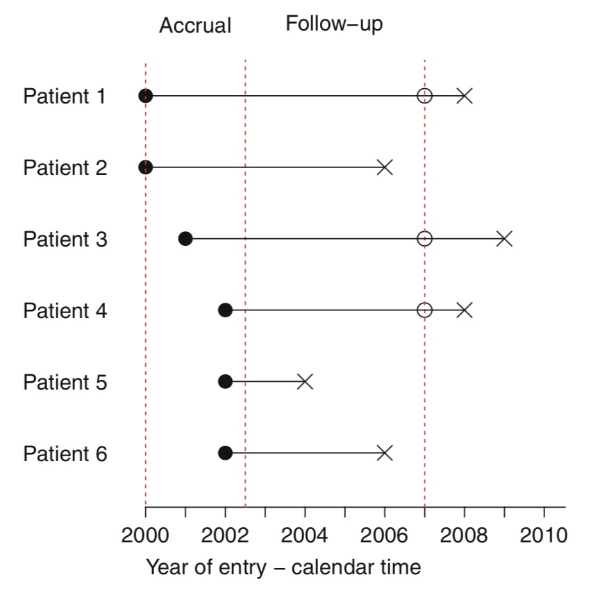
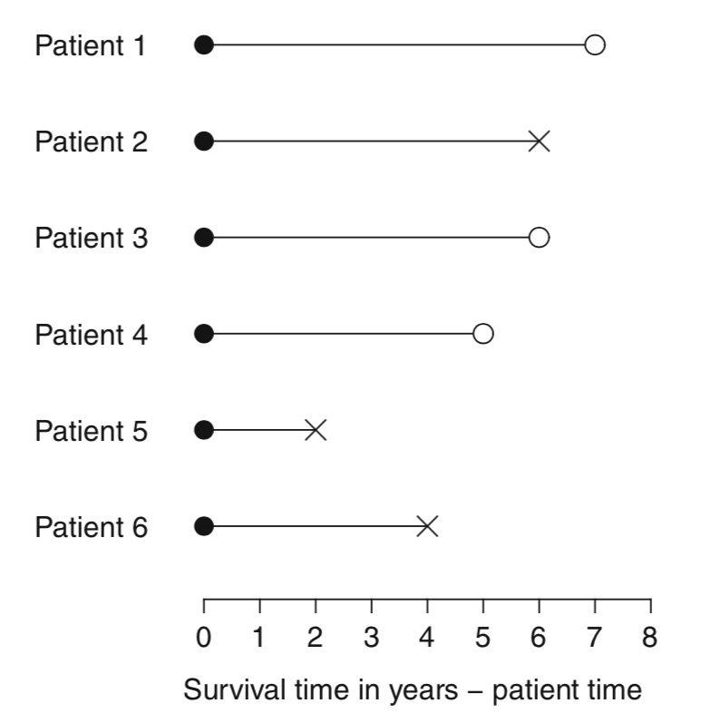
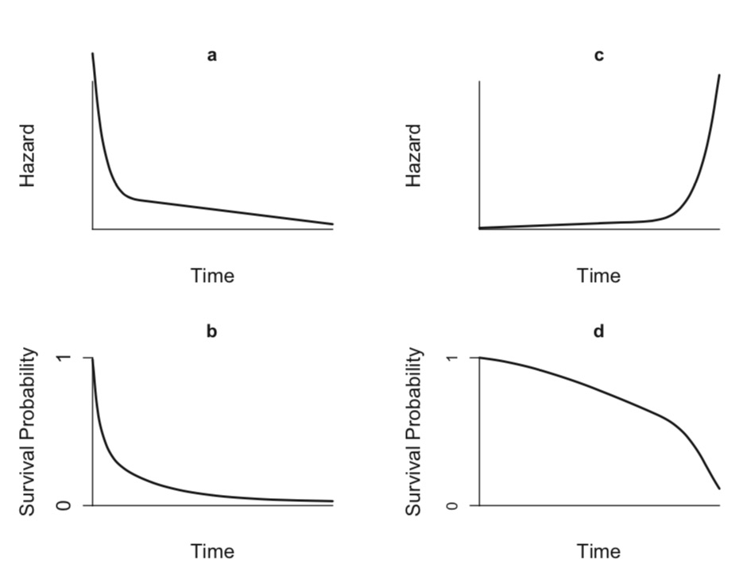
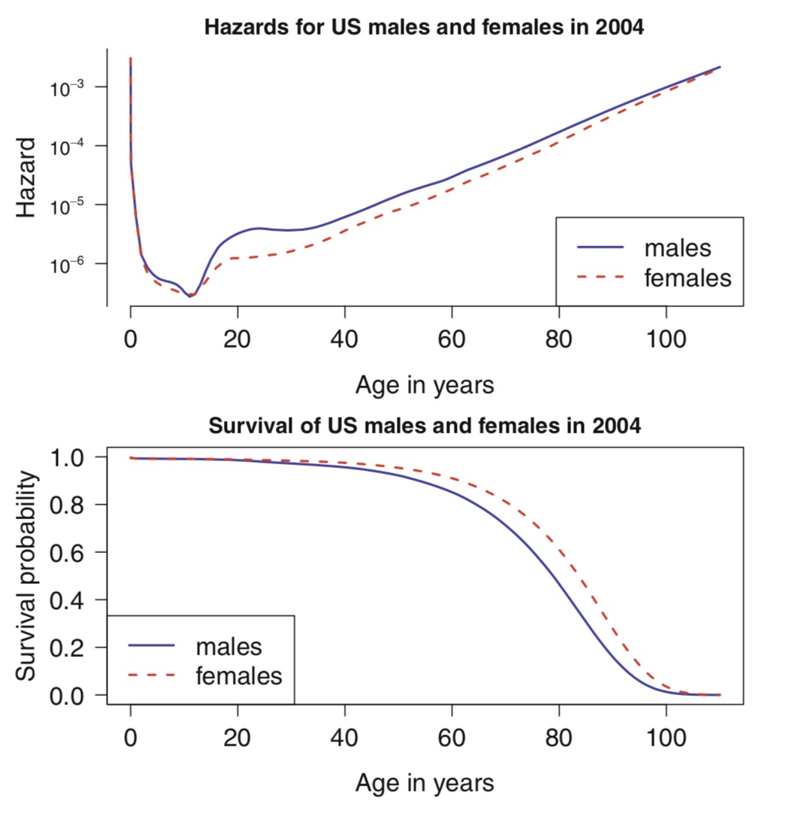
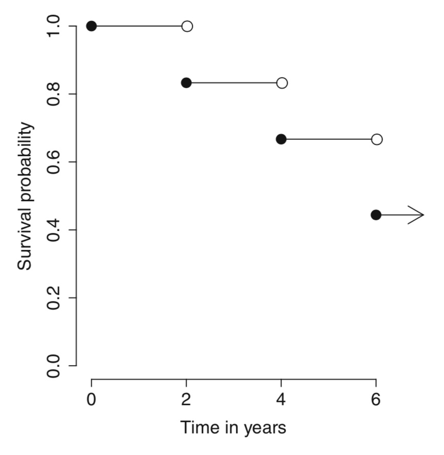
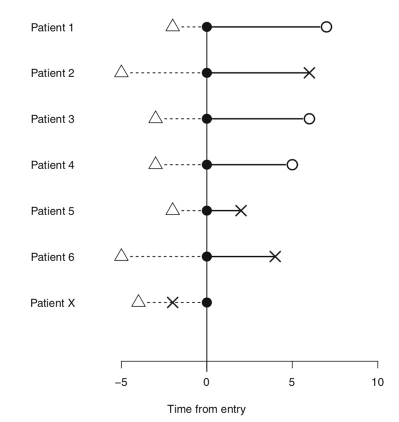
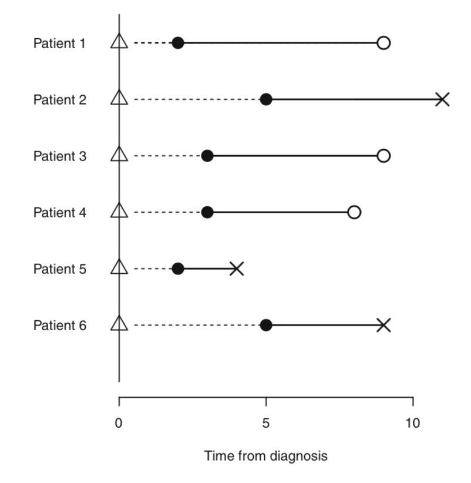
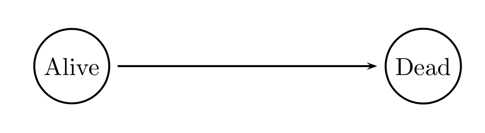

```{r setup, include=FALSE}

```


# Violet Jessop


Source: https://en.wikipedia.org/wiki/Violet_Jessop#/media/File:Violet_jessop_titanic.jpg

# Titanic


# What predicts survival on the Titanic

```{r, message = F, echo = T}
library(readr)
library(dplyr)
titanic <- read_csv("titanic.csv")
```

```{r, eval = F}
glimpse(titanic)
```

```{r}
attach(titanic)
mean(age, na.rm = T)
table(survived, sex)
```

# Linear Regression
```{r}
plot(survived ~ age)
abline(lm(survived~age), col = "red")
```

# Linear Regression 2
```{r}
summary(lm(survived~age))
```

# Logistic Regression

```{r}
summary(glm(survived ~ age, family = "binomial"))
model <- glm(survived ~ age, family = "binomial")
exp(model$coefficients)
```

# Problems with using this approach

* Censoring
    + Right censoring
    + Interval censoring
    + Left censoring
* Truncation
    + Left truncation
    + Right truncation
    + Interval trunncation
  
Hence - Survival analysis

# Conceptual framework


Source: Moore, p. 4

# Survival data

Source: Moore, p. 5


# Some demographic functions

* Survival Function

$$ S(t) = P(T >t),  \  0 <t < \infty $$

* Hazard function

$$ h(t) = \lim_{\delta\to 0} \frac{P(t < T < t + \delta | T > t)}{\delta} $$

# Some examples



# A more realistic example



# Non-parametric estimation

* Kaplan Meier estimator

$$ \hat{S}(t) = \prod_{t_i \leq t} (1 - \hat{q_i}) =  \prod_{t_i \leq t} (1 - \frac{d_i}{n_i}) $$

# Let's do a quick exercise


# Let's do a quick exercise




# Now let's do it in R

```{r}
library(survival)
tt <- c(7,6,6,5,2,4)
cens <- c(0,1,0,0,1,1)
Surv(tt, cens)
```


# Survival model
```{r}
result.km <- survfit(Surv(tt, cens) ~ 1, conf.type="log-log")
result.km
summary(result.km)
```
# Graph
```{r}
plot(result.km)
```


# Hazard estimators

* Nelson-Aalen estimator

$$ H(t) = \sum_{t_i \leq t} \frac{d_i}{n_i}$$
$$ S(t) = e^{-H(t)}$$

# Nelson-Aalen estimator in R

```{r}
result.fh <- survfit(Surv(tt, cens) ~ 1, conf.type = "log-log", type = "fh")
summary(result.fh)
```


# Estimating hazard functions
```{r, echo = F, warning = F}
library(muhaz)
t.vec <- c(7,6,6,5,2,4)
cens.vec <- c(0,1,0,0,1,1)
result.simple <- muhaz(t.vec, cens.vec, max.time = 8, bw.grid = 2.25, bw.method = "global", b.cor = "none")
plot(result.simple)

```

# Smoothed hazard

```{r, echo = F, warning = F}
result.smooth <- muhaz(t.vec, cens.vec, max.time = 8, bw.smooth = 30, b.cor = "left")
plot(result.smooth)
```


# Truncation



# Truncation (patient time)



# Left truncation in R

```{r}
tt <- c(7, 6, 6, 5, 2, 4)
status <- c(0, 1, 0, 0, 1, 1)
backTime <- c(-2, -5, -3, -3, -2, -5)
tm.enter <- -backTime
tm.exit <- tt - backTime
result.left.trunc.km <- survfit(Surv(tm.enter, tm.exit, status, type = "counting") ~ 1, conf.type = "none")
summary(result.left.trunc.km)
```


# Left trunctation in R 2

```{r}
plot(result.left.trunc.km)
```


# Comparing survival curves

```{r}
tt <- c(6, 7, 10, 15, 19, 25)
delta <- c(1, 0, 1, 1, 0, 1)
trt <- c(0, 0, 1, 0, 1, 1)
survdiff(Surv(tt, delta) ~ trt)
```


# Real world example from historical demography

The demographic database of Umea University
http://www.ddb.umu.se


```{r}
library(eha)
data(oldmort)
head(oldmort)
```


# Schematic representation of old age life in Swedent

# Schematic representation of old age life in Swedent




# Analysis in R

```{r, warning = F}
with(oldmort, plot(survfit(Surv(enter, exit, event)~1)))
```

# Survival by sex
```{r, warning = F}
with(oldmort, plot(survfit(Surv(enter, exit, event)~sex)))
```

# Using ggplot to plot slightly nicer graphs
```{r, echo = F, message = F, warning = F}
library(ggplot2)
library(ggfortify)
library(survminer)
attach(oldmort)
```

```{r}
oldm <- survfit(Surv(enter, exit, event)~sex)
autoplot(oldm)
```

# An alternative approach
```{r, message = F}
ggsurvplot(oldm, data = oldmort)
```

# Final adjustment to the graph
```{r}
 oldm_mod <- survfit(Surv(enter - 60, exit - 60, event)~sex)
ggsurvplot(oldm_mod, data = oldmort)
```


# A teaser for tomorrow

This will not work:

```{r, eval = F}
survdiff(Surv(enter, exit, event)~sex, data = oldmort)
```