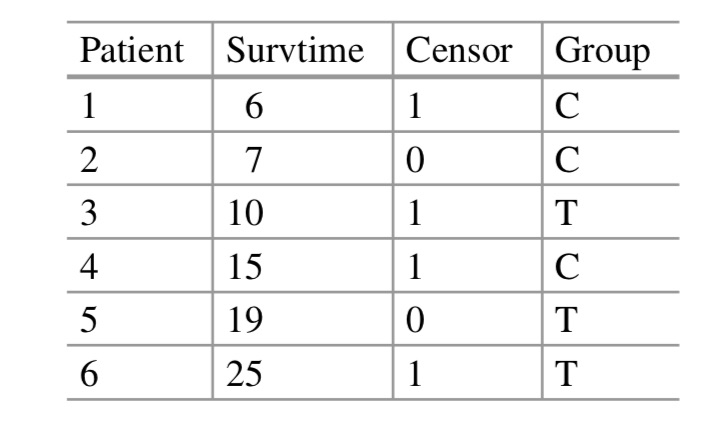
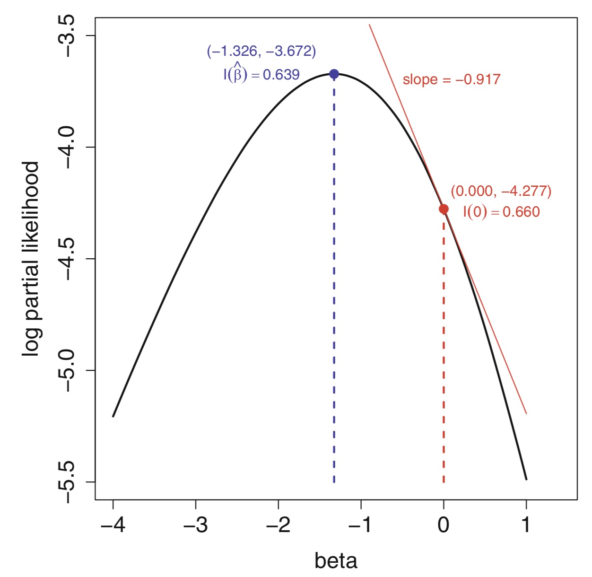

```{r setup, include=FALSE}
knitr::opts_chunk$set(echo = TRUE)
```


# Main assumption of semiparametric methods

* Propotional hazards: 
$$ h_1(t) = \psi h_0(t) $$
* Proportional hazards can be extended to include covariates

$$ \psi = e^{z \beta} $$

* The model then becomes:

$$ h_1(t) = e^{z \beta} h_0(t) $$
It contains a non-parametric specification of the baseline hazard and a parametrized specification of the relationship between hazard and covariates.

# Model estimation

Since the model has an unspecified baseline hazard, maximum likelihood estimation is problematic.

* Probability that an individual fails:

$$ p_1 = \frac{h_i(t_i)}{\sum_{k}h_k(t_1)} = \frac{h_0(t_1)\psi_i}{\sum_{k} h_0(t_1)\psi_k} = \frac{\psi_i}{\sum_{k}\psi_k} $$

With each failure time the risk set diminishes.

Then, the partial likelihood is:
$$ L(\psi) = p_1 p_2 ... p_D $$

Let's look at a practical example




```{r}
plsimple <- function(beta) {
psi <- exp(beta)
result <- log(psi) - log(3*psi + 3) -
       log(3*psi + 1) - log(2*psi + 1)
  result   }

result <- optim(par = 0, fn = plsimple, method = "L-BFGS-B", control = list(fnscale = -1), lower = -3, upper = 1)
result$par
```




# A practical example

```{r}
library(survival)
tt <- c(6, 7, 10, 15, 19, 25)
status <- c(1, 0, 1, 1, 0, 1)
grp <- c(0, 0, 1, 0, 1, 1)
result.cox <- coxph(Surv(tt, status) ~ grp)
summary(result.cox)
```

# How to get these estimates by hand

```{r}
# Score (logrank test)
library(numDeriv)
grad(func = plsimple, x = 0)
hessian(func = plsimple, x = 0)
pchisq(1.274, df=1, lower.tail = F)
```

```{r}
# Wald test
hes <- hessian(func=plsimple, x=result.cox$coefficients)
sqrt(1/-hes)
-1.326/1.251
2*pnorm(1.060, lower.tail=F)
```

```{r}
# Likelihood ratio statistics
betahat <- result.cox$coefficients
2*(plsimple(betahat) - plsimple(0))
pchisq(1.209369, 1, lower.tail=F)
```

## Pseudo R-squared

$$ R^2 = 1 - (\frac{l(0)}{l(\hat{\beta})})^{2/n} $$


# Left truncation

```{r}
tt <- c(6, 7, 10, 15, 19, 25)
status <- c(1, 0, 1, 1, 0, 1)
grp <- c(0, 0, 1, 0, 1, 1)
backTime <- c(-3, -11, -3, -7, -10, -5)
coxph(Surv(tt, status) ~ grp)

tm.enter <- -backTime
tm.exit <- tt - backTime
coxph(Surv(tm.enter, tm.exit, status, type="counting") ~ grp)
```


# Model selection and interpretation

```{r}
lambda.mutant.0 <- 0.03
lambda.mutant.1 <- 0.03*0.55
lambda.wt.0 <- 0.03*0.2
lambda.wt.1 <- 0.03*0.2*0.55
set.seed(4321)
tt.control.mutant <- rexp(25, rate = lambda.mutant.0)
tt.treat.mutant <- rexp(125, rate = lambda.mutant.1)
tt.control.wt <- rexp(125, rate = lambda.wt.0)
tt.treat.wt <- rexp(25, rate = lambda.wt.1)
ttAll <- c(tt.control.mutant, tt.treat.mutant, tt.control.wt, tt.treat.wt)
status <- rep(1, length(ttAll))
genotype <- c(rep("mutant", 150), rep("wt", 150))
trt <- c(rep(0, 25), rep(1, 125), rep(0, 125), rep(1, 25))
coxph(Surv(ttAll, status) ~ trt)
coxph(Surv(ttAll, status) ~ trt + strata(genotype))
coxph(Surv(ttAll, status) ~ trt + genotype)
```


# One more example

```{r}
age <- runif(n = 60, min = 40, max = 80)
race <- factor(c(rep("white", 20), rep("black", 20), rep("other", 20)))
race <- relevel(race, ref = "white")
log.rate.vec <- -4.5 + c(rep(0,20), rep(1,20), rep(2,20)) + age*0.05
tt <- rexp(n = 60, rate = exp(log.rate.vec))
status <- rep(1, 60)
library(survival)
result.cox <- coxph(Surv(tt, status) ~ race + age)
summary(result.cox)
```


# Model comparison

```{r}
library(asaur)
pharmacoSmoking[1:6, 2:8]
attach(pharmacoSmoking)
levels(ageGroup4)
levels(employment)
modelA.coxph <- coxph(Surv(ttr, relapse) ~ ageGroup4)
modelA.coxph
modelB.coxph <- coxph(Surv(ttr, relapse) ~ employment)
modelB.coxph
modelC.coxph <- coxph(Surv(ttr, relapse) ~ ageGroup4 + employment)
modelC.coxph
logLik(modelA.coxph)
logLik(modelB.coxph)
logLik(modelC.coxph)

pchisq(4.567, df=2, lower.tail=F)
pchisq(14.727, df=3, lower.tail=F)

model.null.coxph <- coxph(Surv(ttr, relapse) ~ 1)
logLik(model.null.coxph)
pchisq(12.2206, df=3, lower.tail=F)
anova(modelA.coxph, modelC.coxph)
```


# What to do with non-nested models

```{r}
AIC(modelA.coxph)
AIC(modelB.coxph)
AIC(modelC.coxph)
rm(race)
rm(grp)
modelAll.coxph <- coxph(Surv(ttr, relapse) ~ grp + gender + race + employment + yearsSmoking + levelSmoking +
ageGroup4 + priorAttempts + longestNoSmoke)
result.step <- step(modelAll.coxph, scope=list(upper = ~ grp + gender + race + employment + yearsSmoking +
levelSmoking + ageGroup4 + priorAttempts + longestNoSmoke, lower = ~grp) )
result.step
```


# Spline estimates


```{r}
rm(age)
modelS4.coxph <- coxph(Surv(ttr, relapse) ~ grp + employment + pspline(age, df=4) )
modelS4.coxph
termplot(modelS4.coxph, se=T, terms = 3, ylabs = "Log hazard")
```